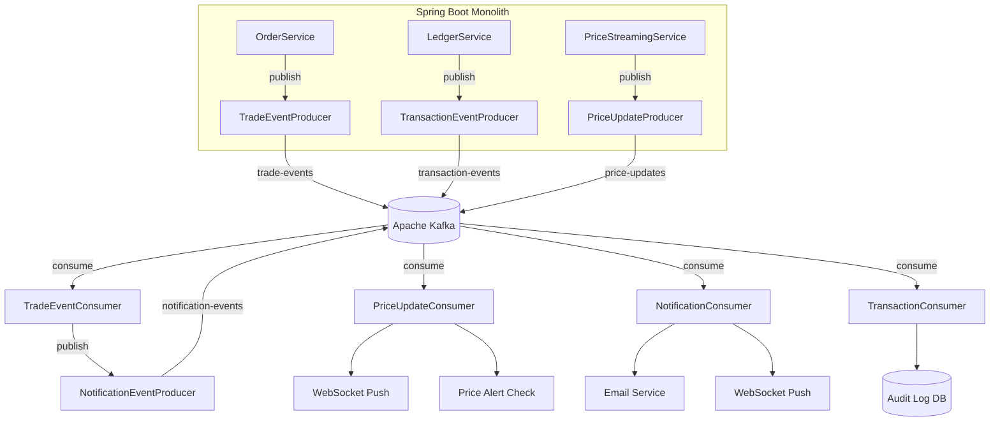

# Apache Kafka Integration — Walkthrough

## What Was Done

Integrated Apache Kafka into the monolithic trading app to make 4 critical flows event-driven: **Trade Execution**, **Price Streaming**, **Notifications**, and **Audit Logging**.

---

## Architecture



---

## Files Created (16 new files)

### Kafka Config
| File | Purpose |
|---|---|
| [KafkaConfig.java](file:///c:/Users/hp/OneDrive/Desktop/TradingAppApplication/backend/src/main/java/com/jeevan/TradingApp/kafka/config/KafkaConfig.java) | Producer/Consumer factories, topic constants |
| [KafkaTopicConfig.java](file:///c:/Users/hp/OneDrive/Desktop/TradingAppApplication/backend/src/main/java/com/jeevan/TradingApp/kafka/config/KafkaTopicConfig.java) | `NewTopic` beans for auto-creation |
| [KafkaErrorHandler.java](file:///c:/Users/hp/OneDrive/Desktop/TradingAppApplication/backend/src/main/java/com/jeevan/TradingApp/kafka/config/KafkaErrorHandler.java) | 3 retries + Dead Letter Topic |

### Event DTOs
| File | Purpose |
|---|---|
| [TradeEvent.java](file:///c:/Users/hp/OneDrive/Desktop/TradingAppApplication/backend/src/main/java/com/jeevan/TradingApp/kafka/events/TradeEvent.java) | Order execution data |
| [PriceUpdateEvent.java](file:///c:/Users/hp/OneDrive/Desktop/TradingAppApplication/backend/src/main/java/com/jeevan/TradingApp/kafka/events/PriceUpdateEvent.java) | Live coin prices |
| [NotificationEvent.java](file:///c:/Users/hp/OneDrive/Desktop/TradingAppApplication/backend/src/main/java/com/jeevan/TradingApp/kafka/events/NotificationEvent.java) | Email + WebSocket notifications |
| [TransactionEvent.java](file:///c:/Users/hp/OneDrive/Desktop/TradingAppApplication/backend/src/main/java/com/jeevan/TradingApp/kafka/events/TransactionEvent.java) | Wallet audit entries |

### Producers
| File | Topic |
|---|---|
| [TradeEventProducer.java](file:///c:/Users/hp/OneDrive/Desktop/TradingAppApplication/backend/src/main/java/com/jeevan/TradingApp/kafka/producer/TradeEventProducer.java) | `trade-events` |
| [PriceUpdateProducer.java](file:///c:/Users/hp/OneDrive/Desktop/TradingAppApplication/backend/src/main/java/com/jeevan/TradingApp/kafka/producer/PriceUpdateProducer.java) | `price-updates` |
| [NotificationEventProducer.java](file:///c:/Users/hp/OneDrive/Desktop/TradingAppApplication/backend/src/main/java/com/jeevan/TradingApp/kafka/producer/NotificationEventProducer.java) | `notification-events` |
| [TransactionEventProducer.java](file:///c:/Users/hp/OneDrive/Desktop/TradingAppApplication/backend/src/main/java/com/jeevan/TradingApp/kafka/producer/TransactionEventProducer.java) | `transaction-events` |

### Consumers
| File | Consumer Group |
|---|---|
| [TradeEventConsumer.java](file:///c:/Users/hp/OneDrive/Desktop/TradingAppApplication/backend/src/main/java/com/jeevan/TradingApp/kafka/consumer/TradeEventConsumer.java) | `trade-group` |
| [PriceUpdateConsumer.java](file:///c:/Users/hp/OneDrive/Desktop/TradingAppApplication/backend/src/main/java/com/jeevan/TradingApp/kafka/consumer/PriceUpdateConsumer.java) | `price-group` |
| [NotificationConsumer.java](file:///c:/Users/hp/OneDrive/Desktop/TradingAppApplication/backend/src/main/java/com/jeevan/TradingApp/kafka/consumer/NotificationConsumer.java) | `notification-group` |
| [TransactionConsumer.java](file:///c:/Users/hp/OneDrive/Desktop/TradingAppApplication/backend/src/main/java/com/jeevan/TradingApp/kafka/consumer/TransactionConsumer.java) | `txn-audit-group` |

### Supporting Files
| File | Purpose |
|---|---|
| [ProcessedEvent.java](file:///c:/Users/hp/OneDrive/Desktop/TradingAppApplication/backend/src/main/java/com/jeevan/TradingApp/modal/ProcessedEvent.java) | JPA entity for idempotency |
| [ProcessedEventRepository.java](file:///c:/Users/hp/OneDrive/Desktop/TradingAppApplication/backend/src/main/java/com/jeevan/TradingApp/repository/ProcessedEventRepository.java) | [existsByEventId()](file:///c:/Users/hp/OneDrive/Desktop/TradingAppApplication/backend/src/main/java/com/jeevan/TradingApp/repository/ProcessedEventRepository.java#7-8) check |
| [PriceStreamingService.java](file:///c:/Users/hp/OneDrive/Desktop/TradingAppApplication/backend/src/main/java/com/jeevan/TradingApp/service/PriceStreamingService.java) | Scheduled CoinGecko → Kafka |
| [schema-audit.sql](file:///c:/Users/hp/OneDrive/Desktop/TradingAppApplication/backend/src/main/resources/schema-audit.sql) | Audit log table DDL |

---

## Files Modified (6 files)

| File | Change |
|---|---|
| [docker-compose.yml](file:///c:/Users/hp/OneDrive/Desktop/TradingAppApplication/docker-compose.yml) | Added Zookeeper, Kafka, topic-init containers |
| [pom.xml](file:///c:/Users/hp/OneDrive/Desktop/TradingAppApplication/backend/pom.xml) | Added `spring-kafka` dependency |
| [.env](file:///c:/Users/hp/OneDrive/Desktop/TradingAppApplication/backend/.env) | Added `KAFKA_BOOTSTRAP_SERVERS` |
| [application.properties](file:///c:/Users/hp/OneDrive/Desktop/TradingAppApplication/backend/src/main/resources/application.properties) | Added Kafka config section |
| [OrderServiceImpl.java](file:///c:/Users/hp/OneDrive/Desktop/TradingAppApplication/backend/src/main/java/com/jeevan/TradingApp/service/OrderServiceImpl.java) | Publishes [TradeEvent](file:///c:/Users/hp/OneDrive/Desktop/TradingAppApplication/backend/src/main/java/com/jeevan/TradingApp/kafka/events/TradeEvent.java#15-32) after BUY/SELL |
| [LedgerServiceImpl.java](file:///c:/Users/hp/OneDrive/Desktop/TradingAppApplication/backend/src/main/java/com/jeevan/TradingApp/service/LedgerServiceImpl.java) | Publishes [TransactionEvent](file:///c:/Users/hp/OneDrive/Desktop/TradingAppApplication/backend/src/main/java/com/jeevan/TradingApp/kafka/events/TransactionEvent.java#15-28) on ledger entry |
| [PriceAlertRepository.java](file:///c:/Users/hp/OneDrive/Desktop/TradingAppApplication/backend/src/main/java/com/jeevan/TradingApp/repository/PriceAlertRepository.java) | Added [findByCoinAndTriggeredFalse()](file:///c:/Users/hp/OneDrive/Desktop/TradingAppApplication/backend/src/main/java/com/jeevan/TradingApp/repository/PriceAlertRepository.java#16-17) |

---

## How to Run Locally

### Step 1: Start Infrastructure
```bash
docker-compose up -d zookeeper kafka kafka-init mysql_db redis
```

### Step 2: Verify Topics Created
```bash
docker exec crypto_kafka kafka-topics --list --bootstrap-server localhost:9092
```
Expected output: `trade-events`, `price-updates`, `notification-events`, `transaction-events`

### Step 3: Run the Audit Schema
```bash
# Connect to MySQL and run schema-audit.sql
docker exec -i crypto_db mysql -utradinguser -ptradingpass TradingAppDB < backend/src/main/resources/schema-audit.sql
```

### Step 4: Build & Run Backend
```bash
cd backend
./mvnw clean compile -DskipTests
./mvnw spring-boot:run
```

### Step 5: Monitor Kafka Topics
```bash
# Watch trade events
docker exec crypto_kafka kafka-console-consumer --topic trade-events --bootstrap-server localhost:9092 --from-beginning

# Watch price updates
docker exec crypto_kafka kafka-console-consumer --topic price-updates --bootstrap-server localhost:9092 --from-beginning
```

---

## Key Design Decisions

1. **Trade execution stays synchronous** — Kafka events are published *after* the trade commits. No risk of partial execution.
2. **Idempotency** — `processed_events` table with unique `eventId` prevents duplicate consumer processing.
3. **Dead Letter Topics** — Failed messages go to `.DLT` after 3 retries (1s back-off).
4. **Partition keys** — `orderId` for trades, `coinId` for prices, `userId` for notifications/transactions — ensures ordering within each entity.
